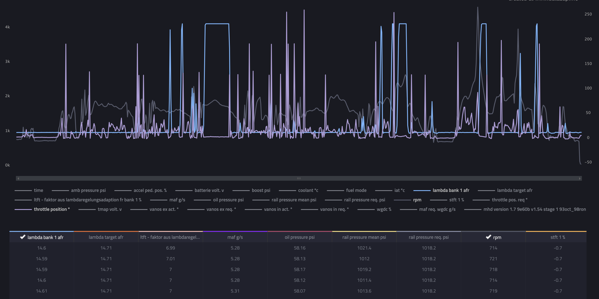
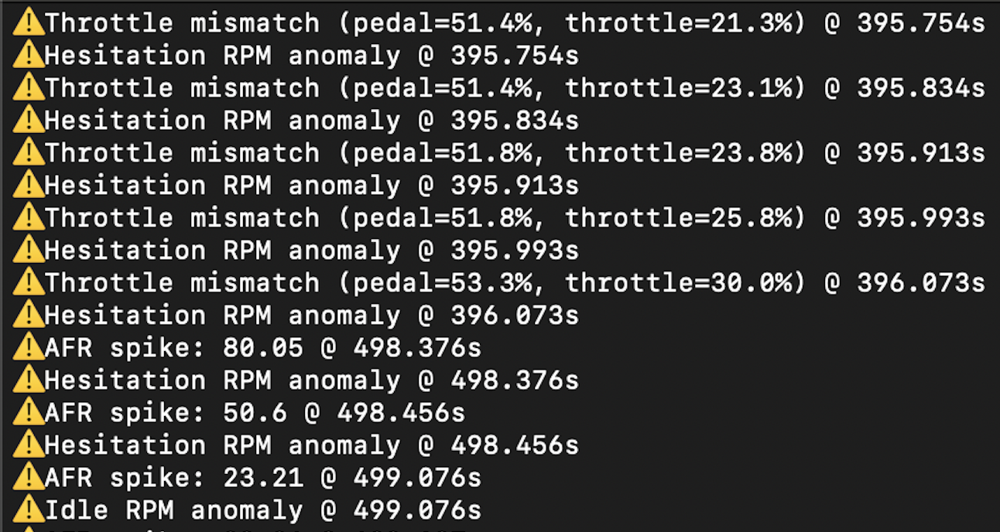

# MHD Log Anomaly Detector

This tool analyzes MHD log files for data anomalies related to engine performance, AFR behavior, throttle behavior, and potential MHD logging bugs.

It has:
An Isolation Forest-based anomaly detector for BMW MHD logs
Engineered features specific to known BMW issues (TPS bug, throttle lag, AFR spikes)
A test suite and training pipeline using real-world data

Clear diagnostic output with timestamps and signal values

---

## Features Detected

### 1. AFR Spikes
- Flags any Air-Fuel Ratio (AFR) values > 20
- Indicates lean conditions, failing sensors, or invalid data
- Useful for identifying lean conditions or sensor faults

### 2. Throttle Mismatch
- Flags mismatches between pedal input and throttle plate
- Flags when the **throttle body opening lags significantly behind pedal input**
- Example: Pedal at 100%, throttle at 30% → Indicates torque limiters, DME logic intervention, or throttle plate issues

### 3. Hesitation RPM Zone
- Flags anomalies in the **1600–1800 RPM band**
- Captures airflow or throttle-related hesitations
- Often associated with poor throttle transitions, airflow delays, or DME logic stumbles

### 4. Idle AFR Instability
- Flags AFR swings during idle (RPM < 900)
- Used to catch idle air control valve issues, misfires, fuel delivery noise, or false sensor readings

### 5. Repeating AFR = 235.19
- Flags repeating 235.19 values as MHD logging bug or wideband sensor failure
- Repeating values are ignored in real analysis but logged for reference

---
From the current log file:
## ⚠️ Sample Output

⚠️ Throttle mismatch (pedal=51.4%, throttle=21.3%) @ 395.754s 

(Throttle mismatch events caught across multiple RPM bands)

⚠️ AFR spike: 235.19 @ 532.295s 
(AFR spikes up to 235.19 detected and flagged. AFR = 235.19 repeated over hundreds of lines → likely MHD logging bug or sensor dropout)

⚠️ Idle RPM anomaly @ 624.188s 
(Idle instability present with rapid AFR changes while below 900 RPM)

⚠️ Hesitation RPM anomaly @ 943.236s 
(Hesitation events correlate with RPM dip zones and throttle lag)

Flags print with timestamps for easy lookup.

It turns this:

Into this:

### What the Output Means:
Each line like:

⚠️ Throttle mismatch (pedal=51.4%, throttle=21.3%) @ 395.754s

⚠️ Hesitation RPM anomaly @ 395.754s

Means:

The model noticed that the pedal position is high, but the throttle isn’t opening accordingly

The RPM is in the 1600–1800 “hesitation” range, and something else was off (e.g., low throttle delta, AFR oddity, etc.

---

## How to Use

1. Place your `.csv` MHD log in the project directory  
2. Run:  
   `python analyze_log.py`  
3. Anomalies will print to console. You can redirect output or integrate JSON logging as needed.

---

## Dependencies

- Python 3.8+
- pandas
- numpy

---

## Future Plans

- Group related anomaly clusters for readability. Add deduplication logic: Don't log the same anomaly every 0.1s unless a threshold is passed.
- Use a --verbose flag to enable full line-by-line output.
- Default output could be summary-style.
- Streamlit UI app front-end for easier review
- Extend detection to boost/airflow anomalies
- Group anomalies into logical blocks
- Add visualization support (e.g., throttle vs. pedal plots, AFR timelines)
- Sensor bug auto-detection logic (e.g., repeated values)

